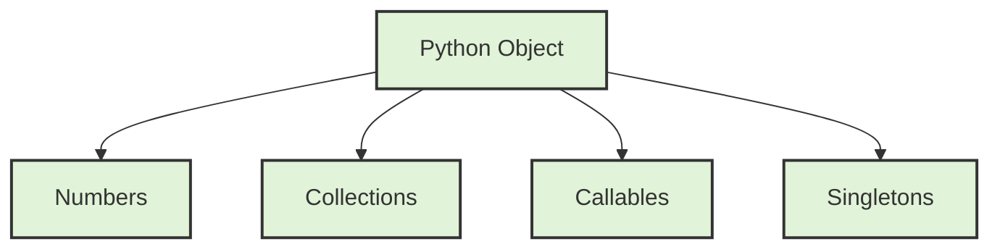
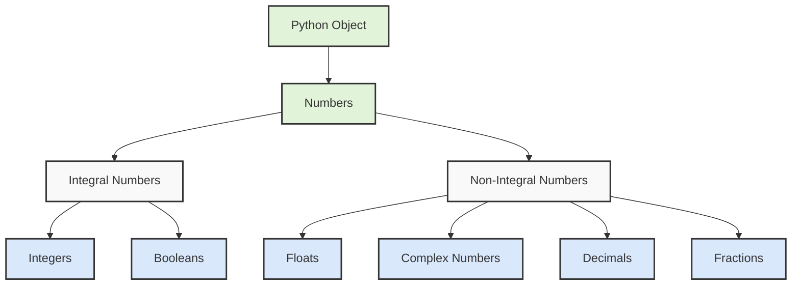
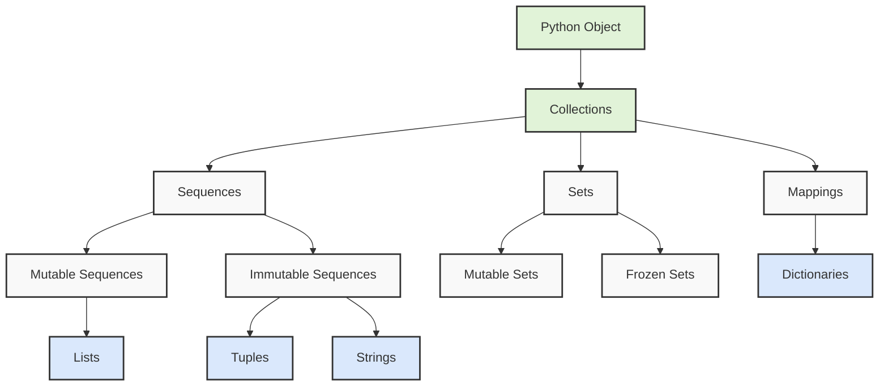

# Python's type hierarchy



First, let's understand what types are in Python. Types define the kind of data a variable can hold and what operations can be performed on it. Python's type system is organized hierarchically, meaning some types are subtypes of others, inheriting their properties.

## Starting with Numbers:

Python has several numeric types, each serving different purposes. At the highest level, we have Numbers, which branch into Integral and Non-Integral types. 

Integral numbers include:
- Integers (int): These represent whole numbers like 1, -5, 1000
- Booleans (bool): While booleans represent True/False, they're actually a subclass of integers, where True = 1 and False = 0

Non-Integral numbers include:
- Floats: These represent decimal numbers like 3.14, -0.001
- Complex numbers: These represent numbers with real and imaginary parts like 3+4j
- Decimals: These provide exact decimal representation, crucial for financial calculations
- Fractions: These represent exact rational numbers like 3/4

## Moving to Collections:

Collections are containers that can hold multiple items. They're divided into three main categories:

Sequences maintain order and allow indexing. They come in two flavors:
1. Mutable sequences (can be modified):
   - Lists: Ordered collections like [1, 2, 3]
2. Immutable sequences (cannot be modified):
   - Tuples: Like lists but unchangeable (1, 2, 3)
   - Strings: Sequences of characters "hello"

Sets are unordered collections of unique elements:
1. Mutable sets: Can add/remove elements
2. Frozen sets: Immutable version of sets

Mappings associate keys with values:
- Dictionaries: The primary mapping type, like {"name": "John", "age": 30}

Let's talk about Callables:
Callables are objects that can be "called" using parentheses (). They include:
1. User-Defined Functions: Functions you create with def or lambda
2. Methods: Functions attached to objects
3. Classes: When called, they create instances
4. Built-in Functions: Like len(), print()

Finally, we have Singletons:
These are special objects with only one instance:
- None: Represents absence of value
- Ellipsis (...): Used in slicing and type hinting
- NotImplemented: Used in arithmetic operations

Here's a practical example to tie it all together:

```python
# Numbers
integer_example = 42                    # int
float_example = 3.14                   # float
complex_example = 3 + 4j               # complex
bool_example = True                    # bool (subclass of int)

# Collections
list_example = [1, 2, 3]              # mutable sequence
tuple_example = (1, 2, 3)             # immutable sequence
string_example = "Hello"              # immutable sequence
set_example = {1, 2, 3}               # mutable set
dict_example = {"a": 1, "b": 2}       # mapping

# Callable
def example_function():               # user-defined function
    return None

# Checking types
print(isinstance(integer_example, int))    # True
print(isinstance(bool_example, int))       # True (because bool is a subclass of int)
print(isinstance(list_example, list))      # True
```

Understanding this hierarchy helps you:
1. Choose the right type for your data
2. Understand what operations are possible on different objects
3. Write more efficient and type-safe code
4. Better understand Python's object-oriented nature
