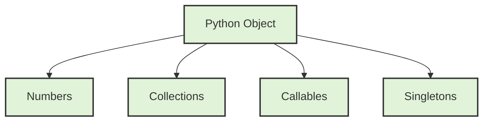
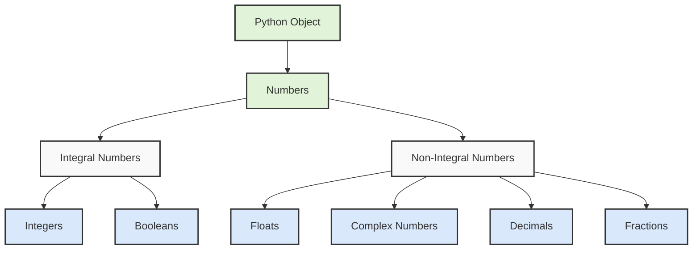
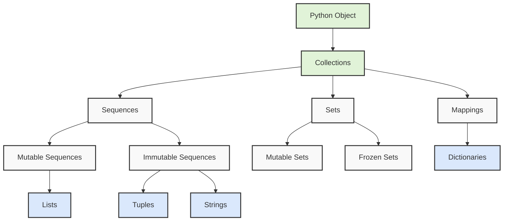
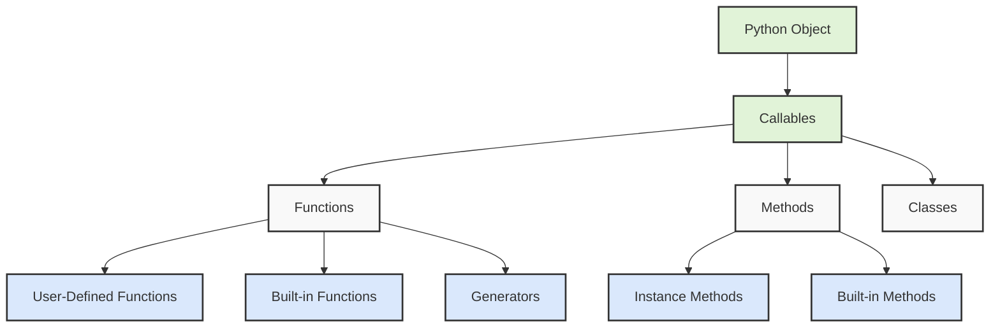
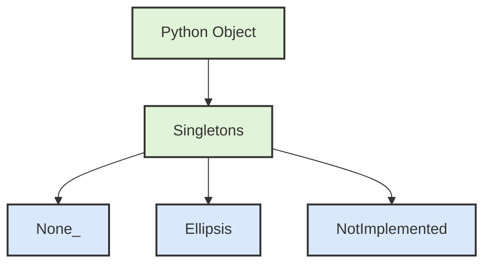

# Python's type hierarchy



First, let's understand what types are in Python. Types define the kind of data a variable can hold and what operations can be performed on it. Python's type system is organized hierarchically, meaning some types are subtypes of others, inheriting their properties.

## Starting with Numbers:

Python has several numeric types, each serving different purposes. At the highest level, we have Numbers, which branch into Integral and Non-Integral types. 

Integral numbers include:
- Integers (int): These represent whole numbers like 1, -5, 1000
- Booleans (bool): While booleans represent True/False, they're actually a subclass of integers, where True = 1 and False = 0

Non-Integral numbers include:
- Floats: These represent decimal numbers like 3.14, -0.001
- Complex numbers: These represent numbers with real and imaginary parts like 3+4j
- Decimals: These provide exact decimal representation, crucial for financial calculations
- Fractions: These represent exact rational numbers like 3/4

## Moving to Collections:

Collections are containers that can hold multiple items. They're divided into three main categories:

Sequences maintain order and allow indexing. They come in two flavors:
1. Mutable sequences (can be modified):
   - Lists: Ordered collections like [1, 2, 3]
2. Immutable sequences (cannot be modified):
   - Tuples: Like lists but unchangeable (1, 2, 3)
   - Strings: Sequences of characters "hello"

Sets are unordered collections of unique elements:
1. Mutable sets: Can add/remove elements
2. Frozen sets: Immutable version of sets

Mappings associate keys with values:
- Dictionaries: The primary mapping type, like {"name": "John", "age": 30}

## Let's talk about Callables:



Callables are objects that can be "called" using parentheses (). They include:
1. User-Defined Functions: Functions you create with def or lambda
2. Methods: Functions attached to objects
3. Classes: When called, they create instances
4. Built-in Functions: Like len(), print()

## Finally, we have Singletons:


These are special objects with only one instance:
- None: Represents absence of value
- Ellipsis (...): Used in slicing and type hinting
- NotImplemented: Used in arithmetic operations

Here's a practical example to tie it all together:

```python
# Numbers
integer_example = 42                    # int
float_example = 3.14                   # float
complex_example = 3 + 4j               # complex
bool_example = True                    # bool (subclass of int)

# Collections
list_example = [1, 2, 3]              # mutable sequence
tuple_example = (1, 2, 3)             # immutable sequence
string_example = "Hello"              # immutable sequence
set_example = {1, 2, 3}               # mutable set
dict_example = {"a": 1, "b": 2}       # mapping

# Callable
def example_function():               # user-defined function
    return None

# Checking types
print(isinstance(integer_example, int))    # True
print(isinstance(bool_example, int))       # True (because bool is a subclass of int)
print(isinstance(list_example, list))      # True
```

Understanding this hierarchy helps you:
1. Choose the right type for your data
2. Understand what operations are possible on different objects
3. Write more efficient and type-safe code
4. Better understand Python's object-oriented nature

# PEP 8 (Python Enhancement Proposal)

PEP 8 specifically focuses on how to format Python code to make it more readable and consistent.

Think of PEP 8 as a set of writing conventions, similar to how we have rules for writing essays or formatting documents. Just as proper paragraph spacing and punctuation make text easier to read, following PEP 8 makes Python code easier to understand and maintain.

Let's explore the key aspects of PEP 8:

## Indentation and Spacing:
PEP 8 recommends using 4 spaces for indentation, rather than tabs. This creates visual consistency across different editors. Here's an example:

```python
# Good indentation
def calculate_average(numbers):
    total = sum(numbers)    # Notice the 4 spaces of indentation
    count = len(numbers)
    return total / count

# Avoid this (incorrect indentation)
def calculate_average(numbers):
  total = sum(numbers)      # Only 2 spaces - not PEP 8 compliant
  count = len(numbers)
  return total / count
```

## Line Length and Line Breaks:
PEP 8 suggests keeping lines at a maximum of 79 characters. This ensures code is readable on smaller screens and when viewing multiple files side by side. For longer lines, you can break them using parentheses or backslashes:

```python
# Long line broken up properly
long_string = (
    "This is a very long string that would "
    "exceed the 79-character limit if written "
    "on a single line."
)

# Long function parameters broken up properly
def complex_function(
        parameter1, parameter2, parameter3,
        parameter4, parameter5):
    return parameter1 + parameter2
```

## Naming Conventions:
PEP 8 defines different naming styles for different types of code elements:

```python
# Module names: short, lowercase
import math
import my_module

# Function names: lowercase with underscores
def calculate_total():
    pass

# Class names: CapitalizedWords (also called CamelCase)
class StudentRecord:
    pass

# Variable names: lowercase with underscores
first_name = "John"
total_count = 0

# Constants: uppercase with underscores
MAX_VALUE = 100
PI = 3.14159
```

### Whitespace Rules:
PEP 8 has specific rules about where to use or avoid spaces:

```python
# Correct spacing around operators
x = 5 + 3

# Correct spacing after commas
numbers = [1, 2, 3, 4]

# Correct function call spacing
def greet(name):
    print(name)    # No space before parenthesis

# Incorrect spacing examples to avoid
x=5+3              # Missing spaces around operators
numbers=[1,2,3,4]  # Missing spaces after commas
def greet (name):  # Unnecessary space before parenthesis
```

## Comments and Documentation:
PEP 8 encourages clear and useful comments:

```python
# Single line comments should have a space after the #
# This is a good comment

#This is not properly spaced

def complex_calculation(x, y):
    """Docstrings should use triple quotes.
    
    They should have a brief summary line, followed
    by a blank line, then more detailed explanation
    if needed.
    """
    return x * y
```

## Imports Organization:
PEP 8 specifies how to organize import statements:

```python
# Standard library imports first
import os
import sys

# Third-party library imports next
import numpy as np
import pandas as pd

# Local application imports last
import my_module
from my_package import my_function
```

Understanding and following PEP 8 is important because:
1. It makes your code more readable for others (and yourself in the future)
2. It helps you collaborate more effectively with other Python developers
3. Many Python projects and companies require PEP 8 compliance
4. It helps catch potential errors by enforcing consistent formatting

To help maintain PEP 8 compliance, you can use tools like:
- pylint: A code analysis tool that checks for PEP 8 compliance
- black: An automatic code formatter that enforces PEP 8 style
- autopep8: Another tool that automatically formats code to follow PEP 8

# "special methods" or "magic methods" system


When you write `x < y`, Python actually converts this into a method call `x.__lt__(y)`. The `__lt__` is a special method name that stands for "less than". This is part of Python's data model that allows objects to define how they behave with various operators.

Let's break this down with a practical example:

```python
class Temperature:
    def __init__(self, celsius):
        self.celsius = celsius
    
    def __lt__(self, other):
        # This method is called when we use < operator
        print(f"Comparing {self.celsius}°C with {other.celsius}°C")
        return self.celsius < other.celsius

# Creating two temperature objects
temp1 = Temperature(20)
temp2 = Temperature(25)

# These two lines do exactly the same thing:
result1 = temp1 < temp2           # Using the < operator
result2 = temp1.__lt__(temp2)     # Direct method call
```

This system is part of a broader concept in Python called "operator overloading," where there's a whole family of special methods for different operators:

```python
# Common comparison operators and their method equivalents
x < y    →   x.__lt__(y)      # less than
x <= y   →   x.__le__(y)      # less than or equal to
x == y   →   x.__eq__(y)      # equal to
x != y   →   x.__ne__(y)      # not equal to
x > y    →   x.__gt__(y)      # greater than
x >= y   →   x.__ge__(y)      # greater than or equal to
```

The beauty of this system is that it allows you to define how your custom objects should behave with standard Python operators. For example, if you're creating a class to represent money:

```python
class Money:
    def __init__(self, amount, currency):
        self.amount = amount
        self.currency = currency
    
    def __lt__(self, other):
        if self.currency != other.currency:
            raise ValueError("Can't compare different currencies!")
        return self.amount < other.amount

# Now we can compare money naturally
usd1 = Money(10, "USD")
usd2 = Money(20, "USD")
print(usd1 < usd2)  # True - works like you'd expect!
```

This is particularly useful because:
1. It makes your code more readable (writing `price1 < price2` is clearer than calling comparison methods directly)
2. It allows your objects to work with Python's built-in functions and methods that use these operators
3. It makes your custom objects behave consistently with Python's built-in types

Understanding this system helps you:
- Create more intuitive interfaces for your custom classes
- Better understand how Python works under the hood
- Debug comparison-related issues in your code
- Write more Pythonic code that follows the language's conventions

# "Pythonic" and "idiomatic" code 

Both refer to writing code that follows the natural style and philosophy of Python, but let's understand them in more depth.

Think of writing code like writing in a language. Just as you can say "How are you?" in English with technically correct but unnatural grammar like "In what state of being are you?", you can write code that works but doesn't feel natural to experienced Python developers.

Pythonic Code:
Pythonic code embraces Python's philosophy of clarity and simplicity, following the principles outlined in "The Zen of Python" (PEP 20). Here's an example comparing non-Pythonic code with Pythonic code:

```python
# Non-Pythonic way to check if a list contains a value
found = False
for item in my_list:
    if item == target:
        found = True
        break
if found:
    print("Found it!")

# Pythonic way - clear, direct, and uses Python's strengths
if target in my_list:
    print("Found it!")
```

Let's look at more examples of Pythonic vs non-Pythonic code:

```python
# Non-Pythonic way to swap variables
temp = a
a = b
b = temp

# Pythonic way - using tuple unpacking
a, b = b, a

# Non-Pythonic way to get index and value while looping
index = 0
for item in items:
    print(f"Item {index}: {item}")
    index += 1

# Pythonic way - using enumerate
for index, item in enumerate(items):
    print(f"Item {index}: {item}")
```

Idiomatic Python:
Idiomatic code refers to using Python's common patterns and constructs that experienced Python developers recognize and expect. Here are some examples:

```python
# Non-idiomatic way to create a list of squares
squares = []
for i in range(10):
    squares.append(i ** 2)

# Idiomatic way - using list comprehension
squares = [i ** 2 for i in range(10)]

# Non-idiomatic way to get dictionary value with default
if key in my_dict:
    value = my_dict[key]
else:
    value = default_value

# Idiomatic way - using get() method
value = my_dict.get(key, default_value)
```

Here's a more complex example showing multiple Pythonic and idiomatic patterns together:

```python
class DataProcessor:
    def __init__(self, data):
        self.data = data

    def process_items(self):
        # Non-Pythonic/Non-idiomatic way
        result = []
        for item in self.data:
            if self.is_valid(item):
                transformed = self.transform(item)
                if transformed is not None:
                    result.append(transformed)
        return result

    def process_items_pythonic(self):
        # Pythonic/Idiomatic way
        return [self.transform(item) 
                for item in self.data 
                if self.is_valid(item) and self.transform(item) is not None]

    @property  # Using properties is idiomatic Python
    def processed_count(self):
        return len(self.process_items())

    def __len__(self):  # Supporting built-in functions is Pythonic
        return len(self.data)
```

Key characteristics of Pythonic and idiomatic code:

1. Explicit is better than implicit:
```python
# Non-Pythonic (implicit)
def process(x):
    if x: return True  # Implicit boolean check

# Pythonic (explicit)
def process(x):
    if x is not None:  # Explicit check for None
        return True
```

2. Using Python's built-in features effectively:
```python
# Using context managers (with statements) is Pythonic
with open('file.txt', 'r') as file:
    content = file.read()
```

3. Following the principle of least surprise:
```python
# Surprising behavior
def modify_list(lst=[]):  # Mutable default argument
    lst.append(1)
    return lst

# Pythonic way
def modify_list(lst=None):
    if lst is None:
        lst = []
    lst.append(1)
    return lst
```

Writing Pythonic and idiomatic code is important because it:
- Makes your code more readable and maintainable
- Helps other Python developers understand your code quickly
- Often leads to more efficient and error-resistant code
- Takes advantage of Python's built-in optimizations
