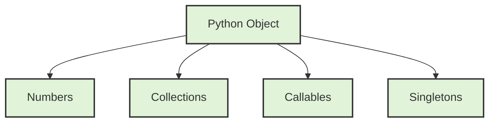
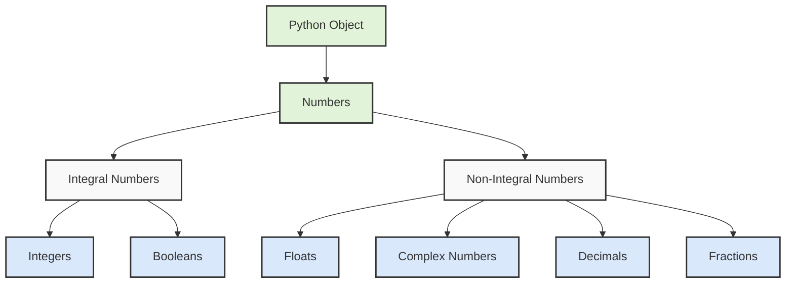
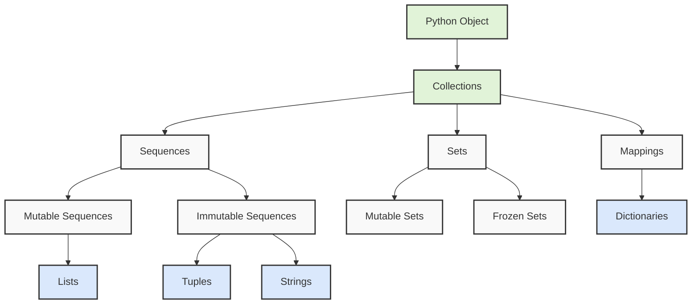
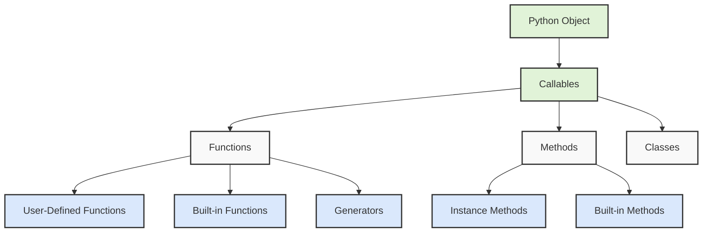
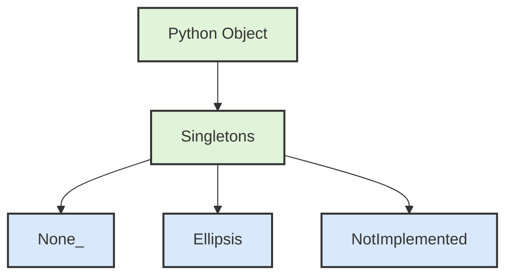
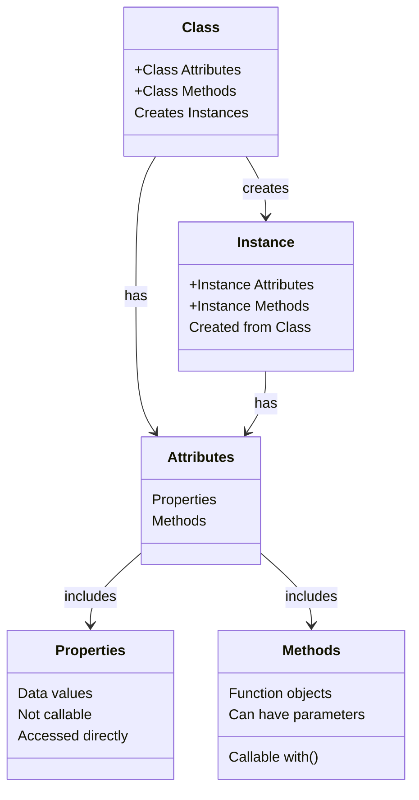

# Python's type hierarchy



First, let's understand what types are in Python. Types define the kind of data a variable can hold and what operations can be performed on it. Python's type system is organized hierarchically, meaning some types are subtypes of others, inheriting their properties.

## Starting with Numbers:

Python has several numeric types, each serving different purposes. At the highest level, we have Numbers, which branch into Integral and Non-Integral types. 

Integral numbers include:
- Integers (int): These represent whole numbers like 1, -5, 1000
- Booleans (bool): While booleans represent True/False, they're actually a subclass of integers, where True = 1 and False = 0

Non-Integral numbers include:
- Floats: These represent decimal numbers like 3.14, -0.001
- Complex numbers: These represent numbers with real and imaginary parts like 3+4j
- Decimals: These provide exact decimal representation, crucial for financial calculations
- Fractions: These represent exact rational numbers like 3/4

## Moving to Collections:

Collections are containers that can hold multiple items. They're divided into three main categories:

Sequences maintain order and allow indexing. They come in two flavors:
1. Mutable sequences (can be modified):
   - Lists: Ordered collections like [1, 2, 3]
2. Immutable sequences (cannot be modified):
   - Tuples: Like lists but unchangeable (1, 2, 3)
   - Strings: Sequences of characters "hello"

Sets are unordered collections of unique elements:
1. Mutable sets: Can add/remove elements
2. Frozen sets: Immutable version of sets

Mappings associate keys with values:
- Dictionaries: The primary mapping type, like {"name": "John", "age": 30}

## Let's talk about Callables:



Callables are objects that can be "called" using parentheses (). They include:
1. User-Defined Functions: Functions you create with def or lambda
2. Methods: Functions attached to objects
3. Classes: When called, they create instances
4. Built-in Functions: Like len(), print()

## Finally, we have Singletons:


These are special objects with only one instance:
- None: Represents absence of value
- Ellipsis (...): Used in slicing and type hinting
- NotImplemented: Used in arithmetic operations

Here's a practical example to tie it all together:

```python
# Numbers
integer_example = 42                    # int
float_example = 3.14                   # float
complex_example = 3 + 4j               # complex
bool_example = True                    # bool (subclass of int)

# Collections
list_example = [1, 2, 3]              # mutable sequence
tuple_example = (1, 2, 3)             # immutable sequence
string_example = "Hello"              # immutable sequence
set_example = {1, 2, 3}               # mutable set
dict_example = {"a": 1, "b": 2}       # mapping

# Callable
def example_function():               # user-defined function
    return None

# Checking types
print(isinstance(integer_example, int))    # True
print(isinstance(bool_example, int))       # True (because bool is a subclass of int)
print(isinstance(list_example, list))      # True
```

Understanding this hierarchy helps you:
1. Choose the right type for your data
2. Understand what operations are possible on different objects
3. Write more efficient and type-safe code
4. Better understand Python's object-oriented nature

# PEP 8 (Python Enhancement Proposal)

PEP 8 specifically focuses on how to format Python code to make it more readable and consistent.

Think of PEP 8 as a set of writing conventions, similar to how we have rules for writing essays or formatting documents. Just as proper paragraph spacing and punctuation make text easier to read, following PEP 8 makes Python code easier to understand and maintain.

Let's explore the key aspects of PEP 8:

## Indentation and Spacing:
PEP 8 recommends using 4 spaces for indentation, rather than tabs. This creates visual consistency across different editors. Here's an example:

```python
# Good indentation
def calculate_average(numbers):
    total = sum(numbers)    # Notice the 4 spaces of indentation
    count = len(numbers)
    return total / count

# Avoid this (incorrect indentation)
def calculate_average(numbers):
  total = sum(numbers)      # Only 2 spaces - not PEP 8 compliant
  count = len(numbers)
  return total / count
```

## Line Length and Line Breaks:
PEP 8 suggests keeping lines at a maximum of 79 characters. This ensures code is readable on smaller screens and when viewing multiple files side by side. For longer lines, you can break them using parentheses or backslashes:

```python
# Long line broken up properly
long_string = (
    "This is a very long string that would "
    "exceed the 79-character limit if written "
    "on a single line."
)

# Long function parameters broken up properly
def complex_function(
        parameter1, parameter2, parameter3,
        parameter4, parameter5):
    return parameter1 + parameter2
```

## Naming Conventions:
PEP 8 defines different naming styles for different types of code elements:

```python
# Module names: short, lowercase
import math
import my_module

# Function names: lowercase with underscores
def calculate_total():
    pass

# Class names: CapitalizedWords (also called CamelCase)
class StudentRecord:
    pass

# Variable names: lowercase with underscores
first_name = "John"
total_count = 0

# Constants: uppercase with underscores
MAX_VALUE = 100
PI = 3.14159
```

### Whitespace Rules:
PEP 8 has specific rules about where to use or avoid spaces:

```python
# Correct spacing around operators
x = 5 + 3

# Correct spacing after commas
numbers = [1, 2, 3, 4]

# Correct function call spacing
def greet(name):
    print(name)    # No space before parenthesis

# Incorrect spacing examples to avoid
x=5+3              # Missing spaces around operators
numbers=[1,2,3,4]  # Missing spaces after commas
def greet (name):  # Unnecessary space before parenthesis
```

## Comments and Documentation:
PEP 8 encourages clear and useful comments:

```python
# Single line comments should have a space after the #
# This is a good comment

#This is not properly spaced

def complex_calculation(x, y):
    """Docstrings should use triple quotes.
    
    They should have a brief summary line, followed
    by a blank line, then more detailed explanation
    if needed.
    """
    return x * y
```

## Imports Organization:
PEP 8 specifies how to organize import statements:

```python
# Standard library imports first
import os
import sys

# Third-party library imports next
import numpy as np
import pandas as pd

# Local application imports last
import my_module
from my_package import my_function
```

Understanding and following PEP 8 is important because:
1. It makes your code more readable for others (and yourself in the future)
2. It helps you collaborate more effectively with other Python developers
3. Many Python projects and companies require PEP 8 compliance
4. It helps catch potential errors by enforcing consistent formatting

To help maintain PEP 8 compliance, you can use tools like:
- pylint: A code analysis tool that checks for PEP 8 compliance
- black: An automatic code formatter that enforces PEP 8 style
- autopep8: Another tool that automatically formats code to follow PEP 8

# "Pythonic" and "idiomatic" code 

Both refer to writing code that follows the natural style and philosophy of Python, but let's understand them in more depth.

Think of writing code like writing in a language. Just as you can say "How are you?" in English with technically correct but unnatural grammar like "In what state of being are you?", you can write code that works but doesn't feel natural to experienced Python developers.

Pythonic Code:
Pythonic code embraces Python's philosophy of clarity and simplicity, following the principles outlined in "The Zen of Python" (PEP 20). Here's an example comparing non-Pythonic code with Pythonic code:

```python
# Non-Pythonic way to check if a list contains a value
found = False
for item in my_list:
    if item == target:
        found = True
        break
if found:
    print("Found it!")

# Pythonic way - clear, direct, and uses Python's strengths
if target in my_list:
    print("Found it!")
```

Let's look at more examples of Pythonic vs non-Pythonic code:

```python
# Non-Pythonic way to swap variables
temp = a
a = b
b = temp

# Pythonic way - using tuple unpacking
a, b = b, a

# Non-Pythonic way to get index and value while looping
index = 0
for item in items:
    print(f"Item {index}: {item}")
    index += 1

# Pythonic way - using enumerate
for index, item in enumerate(items):
    print(f"Item {index}: {item}")
```

Idiomatic Python:
Idiomatic code refers to using Python's common patterns and constructs that experienced Python developers recognize and expect. Here are some examples:

```python
# Non-idiomatic way to create a list of squares
squares = []
for i in range(10):
    squares.append(i ** 2)

# Idiomatic way - using list comprehension
squares = [i ** 2 for i in range(10)]

# Non-idiomatic way to get dictionary value with default
if key in my_dict:
    value = my_dict[key]
else:
    value = default_value

# Idiomatic way - using get() method
value = my_dict.get(key, default_value)
```

Here's a more complex example showing multiple Pythonic and idiomatic patterns together:

```python
class DataProcessor:
    def __init__(self, data):
        self.data = data

    def process_items(self):
        # Non-Pythonic/Non-idiomatic way
        result = []
        for item in self.data:
            if self.is_valid(item):
                transformed = self.transform(item)
                if transformed is not None:
                    result.append(transformed)
        return result

    def process_items_pythonic(self):
        # Pythonic/Idiomatic way
        return [self.transform(item) 
                for item in self.data 
                if self.is_valid(item) and self.transform(item) is not None]

    @property  # Using properties is idiomatic Python
    def processed_count(self):
        return len(self.process_items())

    def __len__(self):  # Supporting built-in functions is Pythonic
        return len(self.data)
```

Key characteristics of Pythonic and idiomatic code:

1. Explicit is better than implicit:
```python
# Non-Pythonic (implicit)
def process(x):
    if x: return True  # Implicit boolean check

# Pythonic (explicit)
def process(x):
    if x is not None:  # Explicit check for None
        return True
```

2. Using Python's built-in features effectively:
```python
# Using context managers (with statements) is Pythonic
with open('file.txt', 'r') as file:
    content = file.read()
```

3. Following the principle of least surprise:
```python
# Surprising behavior
def modify_list(lst=[]):  # Mutable default argument
    lst.append(1)
    return lst

# Pythonic way
def modify_list(lst=None):
    if lst is None:
        lst = []
    lst.append(1)
    return lst
```

Writing Pythonic and idiomatic code is important because it:
- Makes your code more readable and maintainable
- Helps other Python developers understand your code quickly
- Often leads to more efficient and error-resistant code
- Takes advantage of Python's built-in optimizations

# Conditional expressions

Let me explain conditional expressions in Python, which offer a concise way to write simple if-else statements. Think of them as a shorthand way to make decisions in your code, similar to how we might quickly decide what to wear based on the weather.

First, let's understand the traditional if-else structure:

```python
# Traditional if-else structure
if temperature > 30:
    activity = "swimming"
else:
    activity = "hiking"
```

Python's conditional expression (also called a ternary operator) lets us write this more concisely:

```python
# Conditional expression
activity = "swimming" if temperature > 30 else "hiking"
```

The syntax follows this pattern:
```python
value_if_true if condition else value_if_false
```

Let's explore this with more practical examples:

```python
# Example 1: Determining a person's status
age = 20
status = "adult" if age >= 18 else "minor"
print(f"This person is an {status}")  # Output: This person is an adult

# Example 2: Setting a default value
name = input("Enter name: ")
display_name = name if name else "Anonymous"  # Uses "Anonymous" if name is empty

# Example 3: Mathematical operations
x = 10
absolute_value = x if x >= 0 else -x  # Simple absolute value implementation

# Example 4: Choosing appropriate messages
score = 85
message = "Pass" if score >= 60 else "Fail"
```

You can also nest conditional expressions, though you should be careful about readability:

```python
# Nested conditional expression
score = 75
grade = "A" if score >= 90 else "B" if score >= 80 else "C" if score >= 70 else "D" if score >= 60 else "F"

# The above is equivalent to this more readable if-else structure:
if score >= 90:
    grade = "A"
elif score >= 80:
    grade = "B"
elif score >= 70:
    grade = "C"
elif score >= 60:
    grade = "D"
else:
    grade = "F"
```

Here's a more complex example showing how conditional expressions can be used in different contexts:

```python
class User:
    def __init__(self, username, age):
        self.username = username
        self.age = age

    def get_greeting(self):
        time_of_day = 14  # 24-hour format
        
        # Combining multiple conditions
        greeting = "Good morning" if time_of_day < 12 else "Good afternoon" if time_of_day < 18 else "Good evening"
        
        # Using conditional expression with method calls
        age_group = "adult" if self.age >= 18 else "minor"
        
        return f"{greeting}, {self.username}! You are registered as an {age_group}."

# Using the class
user = User("Alice", 25)
print(user.get_greeting())  # Output: Good afternoon, Alice! You are registered as an adult.
```

Some important things to keep in mind about conditional expressions:

1. Best Practices:
```python
# Good: Simple, clear condition
result = x if x > 0 else 0

# Avoid: Complex, hard-to-read conditions
result = x if x > 0 and y < 10 and isinstance(z, str) else 0  # Too complex for conditional expression
```

2. Common Use Cases:
```python
# Default values
config = user_config if user_config else default_config

# Simple transformations
clean_name = name.strip() if name else ""

# Boolean conversions
is_valid = True if count > 0 else False  # Though this could be simplified to: is_valid = count > 0
```

3. Error Prevention:
```python
# Avoiding potential errors
divisor = 5
result = x / divisor if divisor != 0 else "Cannot divide by zero"
```

When should you use conditional expressions?
- When the logic is simple and straightforward
- When you're assigning one of two values based on a condition
- When you want to make your code more concise without sacrificing readability

When should you avoid them?
- When the condition is complex (multiple conditions)
- When you need more than a simple value assignment
- When the code would be clearer with a traditional if-else structure

# While loops

First, let's understand the basic concept of a while loop. Think of a while loop as a repetitive decision maker - it keeps executing a block of code as long as a condition remains true. Here's the fundamental structure:

```python
# Basic while loop structure
while condition:
    # Code block to execute
    # Will keep running as long as condition is True
```

Let's explore the different patterns and features of while loops:

## 1. Standard While Loop:
```python
counter = 0
while counter < 5:
    print(counter)
    counter += 1    # Important: Always ensure you have a way to exit the loop!
```

The interesting thing about while loops is their pre-test nature. This means Python checks the condition before executing the loop body. This leads to an important characteristic: the loop might never execute if the condition is false from the start.

## 2. Do-While Pattern:
While Python doesn't have a built-in do-while loop like some other languages, we can create the same behavior using a while True pattern with a break statement:

```python
# Python's way of implementing a do-while behavior
while True:
    user_input = input("Enter a number (or 'q' to quit): ")
    if user_input == 'q':
        break
    # This code will always execute at least once
    print(f"You entered: {user_input}")
```

This pattern is particularly useful when you need to:
- Validate user input
- Process data at least once
- Handle interactive menus

## 3. While Loops with else:
One of Python's unique features is the ability to attach an else clause to a while loop. This else block executes when the while loop completes normally (without hitting a break statement):

```python
def find_in_list(items, target):
    position = 0
    while position < len(items):
        if items[position] == target:
            print(f"Found {target} at position {position}")
            break
        position += 1
    else:
        print(f"{target} was not found")
        items.append(target)    # Add if not found
```

## 4. Control Flow with continue and break:
These statements give you fine-grained control over loop execution:

```python
# Example showing both continue and break
def process_numbers():
    numbers = []
    while True:
        value = input("Enter a number (or 'done' to finish): ")
        
        if value == 'done':
            break               # Exits the loop entirely
            
        if not value.isdigit():
            print("Please enter a valid number")
            continue           # Skips the rest of this iteration
            
        numbers.append(int(value))
    
    return numbers
```
Without `continue` it will give a error by trying to run `int(value)` for invalid numbers. 

## 5. Input Validation Pattern:
Here's a robust pattern for input validation that demonstrates several while loop concepts:

```python
def get_valid_name():
    while True:
        name = input("Please enter your name: ").strip()
        
        # Multiple conditions for validation
        if len(name) < 2:
            print("Name must be at least 2 characters long")
            continue
        if not name.isalpha():
            print("Name must contain only letters")
            continue
        if not name.isprintable():
            print("Name contains invalid characters")
            continue
            
        return name    # Exit the loop and function when valid

# Usage
user_name = get_valid_name()
print(f"Hello, {user_name}!")
```

Important considerations when using while loops:

1. Exit Conditions:
Always ensure your while loop has a way to terminate. Common mistakes include:
```python
# Problematic - might never terminate
while user_input != 'quit':
    user_input = input("Enter command: ")    # What if user never enters 'quit'?

# Better - adds a maximum attempt limit
max_attempts = 5
attempts = 0
while user_input != 'quit' and attempts < max_attempts:
    user_input = input("Enter command: ")
    attempts += 1
```

2. Loop Variables:
Be careful with loop variables and ensure they're properly updated:
```python
# Common mistake
i = 0
while i < 5:
    print(i)
    # Forgot to increment i - creates infinite loop!

# Correct version
i = 0
while i < 5:
    print(i)
    i += 1    # Don't forget to update the loop variable!
```

# Break, Continue with try/except/finally statements in Loops

Let me help clarify how `continue` behaves differently in a regular `if` statement versus inside a `try/except/finally` block. This is a subtle but important distinction in Python's flow control.

Let's analyze both scenarios:

1. First, let's look at `continue` in a regular `if` statement:
```python
while condition:
    if some_condition:
        continue    # Immediately jumps to the next iteration
    print("This won't execute if continue runs")
```

2. Now, let's examine `continue` in a `try/except/finally` block:
```python
while condition:
    try:
        if error_occurs:
            continue    # Won't jump to next iteration yet!
    except Error:
        # Handle error
    finally:
        print("This WILL execute even if continue runs")
    
    print("This won't execute if continue runs")
```

The key difference lies in how Python handles the `finally` block. The `finally` block is guaranteed to execute even when:
- We hit a `continue` statement
- We hit a `break` statement
- We hit a `return` statement
- An exception occurs

Let's break down your specific example:
```python
a = 0
b = 2

while a < 3:
    print('-------------')
    a += 1
    b -= 1
    try:
        res = a / b
    except ZeroDivisionError:
        print('{0}, {1} - division by 0'.format(a, b))
        res = 0
        continue    # This continue won't take effect immediately
    finally:
        print('{0}, {1} - always executes'.format(a, b))  # This will run!
        
    print('{0}, {1} - main loop'.format(a, b))
```

Let's trace the execution when b equals 0:
1. We enter the try block
2. Division by zero occurs
3. We catch the exception in the except block
4. We set res = 0 and hit continue
5. BUT before the continue can send us to the next iteration, Python ensures the finally block executes
6. After the finally block completes, then the continue takes effect
7. The last print statement is skipped

Here's a clearer example to demonstrate this behavior:
```python
def demonstrate_continue_behavior():
    i = 0
    while i < 3:
        print(f"\nIteration {i}")
        try:
            print("Try block start")
            if i == 1:
                print("About to continue...")
                continue
        except Exception:
            print("Except block")
        finally:
            print("Finally block - ALWAYS executes!")
            
        print("Main loop - only executes if continue wasn't called")
        i += 1

demonstrate_continue_behavior()
```

This demonstrates an important principle in Python: the `finally` block is guaranteed to execute no matter what. This guarantee is stronger than the immediate jump behavior of `continue`. Think of it like this:
- A regular `continue` is like saying "skip to the next iteration now"
- A `continue` in a try block is like saying "skip to the next iteration, but first make sure we clean up properly"

This behavior is particularly useful when you need to ensure certain cleanup code always runs, such as:
- Closing files
- Releasing locks
- Cleaning up resources
- Logging completion status

# Custom Classes


Let me help you understand Python's custom classes by breaking down the key concepts and explaining how they work together. I'll walk you through the core ideas and show how Python's special methods make classes more powerful and intuitive to use.

First, let's understand what a class is and how to create a basic one:

```python
class Rectangle:
    def __init__(self, width, height):
        self.width = width
        self.height = height
```

The `__init__` method is a special method (also called a constructor) that initializes a new Rectangle object. When you create a new Rectangle, Python automatically calls this method. The `self` parameter refers to the instance being created.

Let's explore how to add functionality through methods:

```python
class Rectangle:
    def __init__(self, width, height):
        self.width = width
        self.height = height
        
    def area(self):
        return self.width * self.height
    
    def perimeter(self):
        return 2 * (self.width + self.height)
```

Now let's look at Python's special methods that make our classes behave more like built-in types. These methods let us define how our objects should work with Python's built-in functions and operators:

```python
class Rectangle:
    def __init__(self, width, height):
        self.width = width
        self.height = height
    
    def area(self):
        return self.width * self.height
    
    # String representation for humans to read
    def __str__(self):
        return f'Rectangle (width={self.width}, height={self.height})'
    
    # String representation for developers/debugging
    def __repr__(self):
        return f'Rectangle({self.width}, {self.height})'
    
    # Equality comparison
    def __eq__(self, other):
        if isinstance(other, Rectangle):
            return (self.width, self.height) == (other.width, other.height)
        return False
    
    # Less than comparison based on area
    def __lt__(self, other):
        if isinstance(other, Rectangle):
            return self.area() < other.area()
        return NotImplemented
```

One of Python's most powerful features is its property system, which allows us to control access to attributes while maintaining a clean syntax. Here's how we can add validation to our Rectangle class:

```python
class Rectangle:
    def __init__(self, width, height):
        # Use None as initial values
        self._width = None
        self._height = None
        # Use property setters for validation during initialization
        self.width = width    # This calls the width.setter
        self.height = height  # This calls the height.setter
    
    @property
    def width(self):
        """Get the rectangle's width"""
        return self._width
    
    @width.setter
    def width(self, value):
        """Set the rectangle's width with validation"""
        if not isinstance(value, (int, float)):
            raise TypeError("Width must be a number")
        if value <= 0:
            raise ValueError("Width must be positive")
        self._width = value

    @property
    def height(self):
        """Get the rectangle's height"""
        return self._height
    
    @height.setter
    def height(self, value):
        """Set the rectangle's height with validation"""
        if not isinstance(value, (int, float)):
            raise TypeError("Height must be a number")
        if value <= 0:
            raise ValueError("Height must be positive")
        self._height = value
```

This design provides several benefits:
1. We can validate values when they're set
2. We can change the implementation without changing the interface
3. We maintain a clean, intuitive syntax for users of our class
4. We catch errors early during object creation

Let's see how this works in practice:

```python
# Create a valid rectangle
r1 = Rectangle(10, 20)
print(r1.width)  # Prints: 10

# Try to set an invalid width
try:
    r1.width = -5
except ValueError as e:
    print(e)     # Prints: Width must be positive

# Try to set an invalid type
try:
    r1.height = "twenty"
except TypeError as e:
    print(e)     # Prints: Height must be a number
```

# Python's class system

Let's think of a class like a blueprint for creating objects. Just as a blueprint for a house contains specifications for what the house will have (rooms, windows) and what you can do in it (enter through doors, cook in the kitchen), a class contains specifications for what data it will hold and what actions it can perform.

First, let's clarify these key terms:

## Class:
A class is the blueprint or template that defines what properties and behaviors the objects will have. For example:
```python
class Car:
    def __init__(self, color, model):
        self.color = color    # This is a property
        self.model = model    # This is also a property
        
    def drive(self):         # This is a method
        return f"The {self.color} {self.model} is driving"
```

## Instance:
An instance is a specific object created from a class. If a class is the blueprint, an instance is the actual house built from that blueprint. For example:
```python
my_car = Car("red", "Toyota")  # my_car is an instance of the Car class
```

## Attributes:
Attributes are all the things that belong to a class or instance. There are two types:
- Properties (data attributes): These store data and are not callable. When we say "not callable," it means you can't use parentheses to call them like functions. For example:
  ```python
  my_car.color        # This works - accessing a property
  my_car.color()      # This fails - can't call a property
  ```
- Methods (function attributes): These are functions that belong to the class and are callable. For example:
  ```python
  my_car.drive()      # This works - calling a method
  ```

## Self:
`self` refers to the instance being worked with. It's automatically passed as the first argument to instance methods. Think of it as a way for the method to know which specific instance it's operating on.

## Parameters vs Arguments:
- Parameters are the variables listed in the method definition
- Arguments are the actual values passed to the method
```python
def __init__(self, color, model):   # color and model are parameters
    self.color = color

my_car = Car("red", "Toyota")       # "red" and "Toyota" are arguments
```

A diagram to visualize these relationships:



To further illustrate these concepts, let's see them all working together in a practical example:

```python
class BankAccount:
    # Class attribute - shared by all instances
    bank_name = "Python National Bank"
    
    def __init__(self, account_holder, balance):
        # Instance properties
        self.account_holder = account_holder  # Property
        self._balance = balance              # Protected property
        
    @property
    def balance(self):                       # Property with getter
        return self._balance
        
    def deposit(self, amount):               # Instance method
        if amount > 0:
            self._balance += amount
            return f"Deposited ${amount}"
    
    @classmethod
    def get_bank_name(cls):                  # Class method
        return cls.bank_name
```

In this example:
1. `BankAccount` is the class (blueprint)
2. `bank_name` is a class attribute (shared by all instances)
3. `account_holder` and `_balance` are properties (instance attributes)
4. `deposit` is a method (instance method)
5. `balance` is a property with a getter (using the @property decorator)
6. `get_bank_name` is a class method (can be called on the class itself)

When we create and use an instance:
```python
# Creating an instance
account = BankAccount("John", 1000)

# Accessing properties
print(account.account_holder)    # Property access
print(account.balance)          # Property with getter

# Calling methods
account.deposit(500)            # Method call

# Accessing class attribute
print(BankAccount.bank_name)    # Class attribute access
```

# Python's comparison system

Let me explain this interesting behavior in Python's comparison system. This is a great example of how Python tries to make developers' lives easier through smart language design.

When you write `r1 > r2`, Python follows a specific process to determine how to handle this comparison. Here's what happens under the hood:

1. First, Python looks for a `__gt__` (greater than) method in `r1`'s class. In this case, we haven't defined one, so it's not found.

2. Instead of immediately giving up, Python employs what's called "reflection" or "mirroring" of comparison operators. It knows that "greater than" and "less than" are mathematical opposites, so:
   ```python
   a > b  is equivalent to  b < a
   ```

3. So Python automatically tries to call `r2.__lt__(r1)` (less than) instead. Since we did define the `__lt__` method, this works!

This is why the following two comparisons give consistent results:
```python
r1 > r2  # Python translates this to: r2.__lt__(r1)
r2 < r1  # Direct call to: r2.__lt__(r1)
```

Let's look at our `__lt__` implementation to understand why this works mathematically:
```python
def __lt__(self, other):
    if isinstance(other, Rectangle):
        return self.area() < other.area()
    else:
        return NotImplemented
```

When we do `r1 > r2`, Python effectively asks: "Is r2 less than r1?" using this same method.

This automatic reflection is part of Python's "rich comparison" system, which includes several pairs of reflected operators:
- `>` reflects to `<`
- `>=` reflects to `<=`
- `<` reflects to `>`
- `<=` reflects to `>=`

This system helps reduce the amount of code we need to write. Instead of implementing both `__lt__` and `__gt__`, we can often implement just one and let Python handle the reflection automatically.

However, it's important to note that while Python provides this convenient behavior, you might sometimes want to implement both methods explicitly if:
1. The comparison logic isn't perfectly symmetric
2. You want to optimize performance for both operations
3. You need to handle special cases differently for each direction of comparison

This reflection system is a great example of Python's "batteries included" philosophy - it provides helpful features that make development more efficient while still allowing developers to override the default behavior when needed.


# "special methods" or "magic methods" system


When you write `x < y`, Python actually converts this into a method call `x.__lt__(y)`. The `__lt__` is a special method name that stands for "less than". This is part of Python's data model that allows objects to define how they behave with various operators.

Let's break this down with a practical example:

```python
class Temperature:
    def __init__(self, celsius):
        self.celsius = celsius
    
    def __lt__(self, other):
        # This method is called when we use < operator
        print(f"Comparing {self.celsius}°C with {other.celsius}°C")
        return self.celsius < other.celsius

# Creating two temperature objects
temp1 = Temperature(20)
temp2 = Temperature(25)

# These two lines do exactly the same thing:
result1 = temp1 < temp2           # Using the < operator
result2 = temp1.__lt__(temp2)     # Direct method call
```

This system is part of a broader concept in Python called "operator overloading," where there's a whole family of special methods for different operators:

```python
# Common comparison operators and their method equivalents
x < y    →   x.__lt__(y)      # less than
x <= y   →   x.__le__(y)      # less than or equal to
x == y   →   x.__eq__(y)      # equal to
x != y   →   x.__ne__(y)      # not equal to
x > y    →   x.__gt__(y)      # greater than
x >= y   →   x.__ge__(y)      # greater than or equal to
```

The beauty of this system is that it allows you to define how your custom objects should behave with standard Python operators. For example, if you're creating a class to represent money:

```python
class Money:
    def __init__(self, amount, currency):
        self.amount = amount
        self.currency = currency
    
    def __lt__(self, other):
        if self.currency != other.currency:
            raise ValueError("Can't compare different currencies!")
        return self.amount < other.amount

# Now we can compare money naturally
usd1 = Money(10, "USD")
usd2 = Money(20, "USD")
print(usd1 < usd2)  # True - works like you'd expect!
```

This is particularly useful because:
1. It makes your code more readable (writing `price1 < price2` is clearer than calling comparison methods directly)
2. It allows your objects to work with Python's built-in functions and methods that use these operators
3. It makes your custom objects behave consistently with Python's built-in types

Understanding this system helps you:
- Create more intuitive interfaces for your custom classes
- Better understand how Python works under the hood
- Debug comparison-related issues in your code
- Write more Pythonic code that follows the language's conventions

# Python's special method Examples

Let me explain Python's special methods (also called magic methods or dunder methods) comprehensively. These methods allow us to define how our objects behave with Python's built-in operations and functions.

First, let's understand what makes these methods "special":
1. They're surrounded by double underscores (e.g., `__init__`)
2. Python calls them automatically in specific situations
3. They let our custom objects work like built-in types

Let me create a comprehensive class that demonstrates many special methods:

```python
class Book:
    def __init__(self, title, author, pages, price):
        # Constructor - called when creating new instance
        self.title = title
        self.author = author
        self.pages = pages
        self.price = price
        self.current_page = 0

    # String Representation Methods
    def __str__(self):
        # Called by str() and print()
        return f"{self.title} by {self.author}"
    
    def __repr__(self):
        # Called for object representation in debugger/REPL
        return f'Book("{self.title}", "{self.author}", {self.pages}, {self.price})'
    
    # Comparison Methods
    def __eq__(self, other):
        # Called when using == operator
        if not isinstance(other, Book):
            return NotImplemented
        return (self.title, self.author) == (other.title, other.author)
    
    def __lt__(self, other):
        # Called when using < operator
        if not isinstance(other, Book):
            return NotImplemented
        return self.price < other.price
    
    # Numeric Methods
    def __add__(self, other):
        # Called when using + operator
        if isinstance(other, Book):
            return self.price + other.price
        return NotImplemented
    
    def __len__(self):
        # Called when using len()
        return self.pages
    
    # Container Methods
    def __getitem__(self, page_num):
        # Called when using square bracket notation
        if not isinstance(page_num, int):
            raise TypeError("Page number must be an integer")
        if page_num < 0 or page_num >= self.pages:
            raise IndexError("Page number out of range")
        return f"Content of page {page_num}"
    
    # Iterator Methods
    def __iter__(self):
        # Called when using iter() or in for loops
        self.current_page = 0
        return self
    
    def __next__(self):
        # Called when using next() or in for loops
        if self.current_page >= self.pages:
            raise StopIteration
        content = f"Reading page {self.current_page}"
        self.current_page += 1
        return content
    
    # Context Manager Methods
    def __enter__(self):
        # Called when entering 'with' block
        print(f"Opening {self.title}")
        return self
    
    def __exit__(self, exc_type, exc_value, traceback):
        # Called when exiting 'with' block
        print(f"Closing {self.title}")
        
    # Attribute Methods
    def __getattr__(self, name):
        # Called when accessing undefined attribute
        return f"'{self.title}' has no attribute '{name}'"
    
    def __setattr__(self, name, value):
        # Called when setting any attribute
        if name == "price" and value < 0:
            raise ValueError("Price cannot be negative")
        super().__setattr__(name, value)
```

Let's see how to use this class and understand what each special method enables:

```python
# Creating books
book1 = Book("Python 101", "John Doe", 200, 29.99)
book2 = Book("Python 101", "John Doe", 200, 34.99)

# String representation
print(book1)                # Uses __str__
print(repr(book1))         # Uses __repr__

# Comparison
print(book1 == book2)      # Uses __eq__
print(book1 < book2)       # Uses __lt__

# Numeric operations
total_price = book1 + book2  # Uses __add__
print(f"Total price: ${total_price}")

# Length
print(f"Number of pages: {len(book1)}")  # Uses __len__

# Indexing
print(book1[5])            # Uses __getitem__

# Iteration
for page in book1:         # Uses __iter__ and __next__
    print(page)
    if page.endswith("5"):
        break

# Context manager
with book1 as b:           # Uses __enter__ and __exit__
    print(f"Reading {b.title}")

# Attribute access
print(book1.nonexistent)   # Uses __getattr__
try:
    book1.price = -10     # Uses __setattr__
except ValueError as e:
    print(e)
```

Here's a comprehensive list of special methods by category:

1. Construction and Initialization:
```python
__new__(cls, ...)      # Object creation
__init__(self, ...)    # Object initialization
__del__(self)          # Object destruction
```

2. String Representation:
```python
__str__(self)          # str() and print()
__repr__(self)         # repr()
__format__(self, spec) # format() and f-strings
```

3. Comparison Operations:
```python
__eq__(self, other)    # ==
__ne__(self, other)    # !=
__lt__(self, other)    # 
__le__(self, other)    # <=
__gt__(self, other)    # >
__ge__(self, other)    # >=
```

4. Numeric Operations:
```python
__add__(self, other)   # +
__sub__(self, other)   # -
__mul__(self, other)   # *
__truediv__(self, other)  # /
__floordiv__(self, other) # //
__mod__(self, other)   # %
__pow__(self, other)   # **
```

5. Container Methods:
```python
__len__(self)          # len()
__getitem__(self, key) # self[key]
__setitem__(self, key, value) # self[key] = value
__delitem__(self, key) # del self[key]
__contains__(self, item) # in operator
```

6. Iterator Methods:
```python
__iter__(self)         # iter()
__next__(self)         # next()
```

7. Attribute Access:
```python
__getattr__(self, name)    # Fallback for undefined attributes
__getattribute__(self, name) # All attribute access
__setattr__(self, name, value) # Setting attributes
__delattr__(self, name)    # Deleting attributes
```

8. Context Manager:
```python
__enter__(self)        # with statement entry
__exit__(self, exc_type, exc_value, traceback) # with statement exit
```

9. Callable Objects:
```python
__call__(self, *args, **kwargs) # Makes instance callable
```

# Python Vs. Java's property system 

Let me explain this key difference between Python and Java's approach to properties and why it matters for software design.

Think of this like designing a house. In Java, you have to decide upfront whether people will enter rooms through regular doors or through a more controlled entrance with a security desk. If you start with regular doors and later want to add security, you'll need to rebuild all the entrances, and everyone who used those doors will need to change their route.

In Python, it's different. Python lets you start with simple doors, but you can add a security desk later without changing the appearance or location of the doors. Everyone keeps using the same entrance - they just don't realize there's now a security check happening behind the scenes.

Let's see this in action with code. First, let's create a simple Python class with direct property access:

```python
class Book:
    def __init__(self, price):
        self.price = price    # Direct property access

# People use the class like this:
book = Book(29.99)
book.price = 19.99           # Direct property access
print(book.price)            # Direct property access
```

Now imagine months later, we need to add validation to ensure prices are positive. In Java, we'd need to change the property to private and add getters/setters, breaking all existing code. But in Python, we can add validation without changing how people use our class:

```python
class Book:
    def __init__(self, price):
        self._price = None    # Note the underscore convention
        self.price = price    # This will use our new setter
    
    @property
    def price(self):
        return self._price
    
    @price.setter
    def price(self, value):
        if value < 0:
            raise ValueError("Price cannot be negative")
        self._price = value

# The amazing part: existing code continues to work exactly the same!
book = Book(29.99)
book.price = 19.99           # Still looks like direct access
print(book.price)            # Still looks like direct access
```

The beauty of Python's approach is that `obj.price` is actually a syntax for computed attributes rather than direct variable access. When you write `obj.price`, Python knows to look for a `@property` decorator and call the appropriate getter or setter method.

This design creates several advantages:
1. You can start simple and add complexity only when needed
2. Your code's interface stays clean and intuitive
3. You can add validation, logging, or computation without breaking existing code
4. You don't need to write boilerplate getter/setter methods until they're actually needed

This is part of Python's "we're all consenting adults here" philosophy - it trusts developers to use direct attribute access responsibly, while providing tools to add control when necessary. Rather than forcing you to defensively add getters and setters everywhere like Java, Python lets you write simpler code up front and evolve it naturally as requirements change.

This flexibility is why you'll often see Python codebases using direct attribute access as a perfectly acceptable design pattern, unlike in Java where it would be considered poor practice. It's a great example of how Python's design emphasizes practicality and simplicity while still providing powerful tools for when you need them.