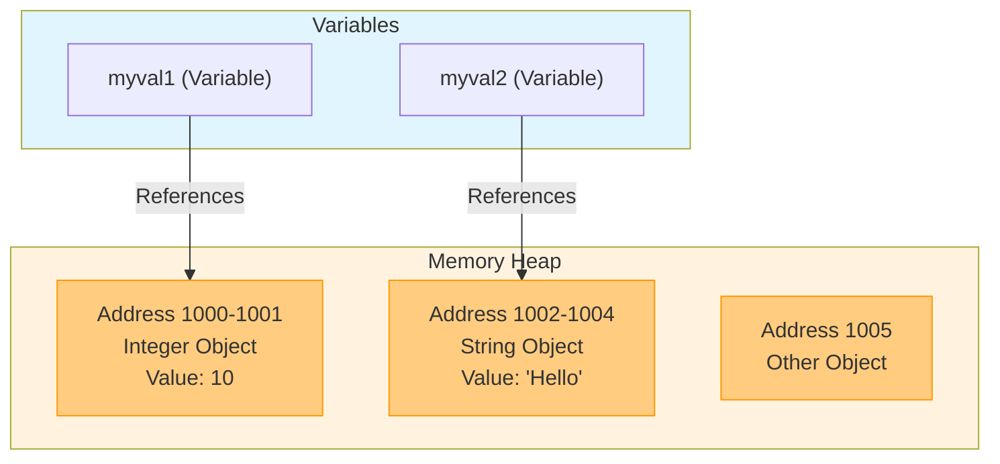
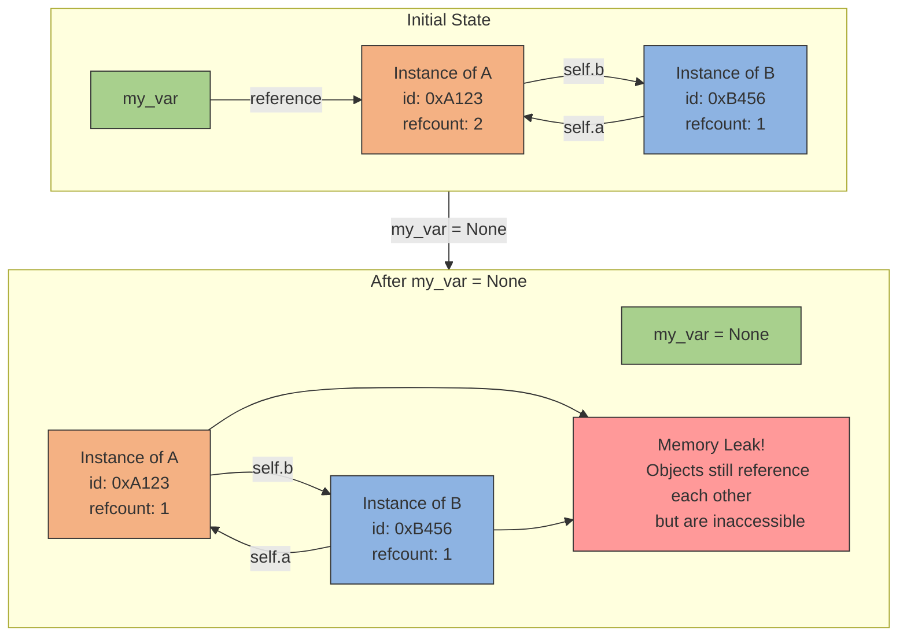
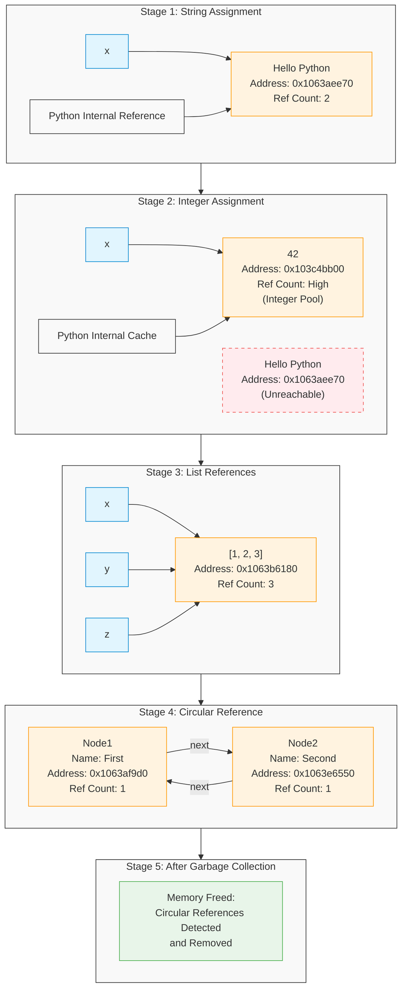
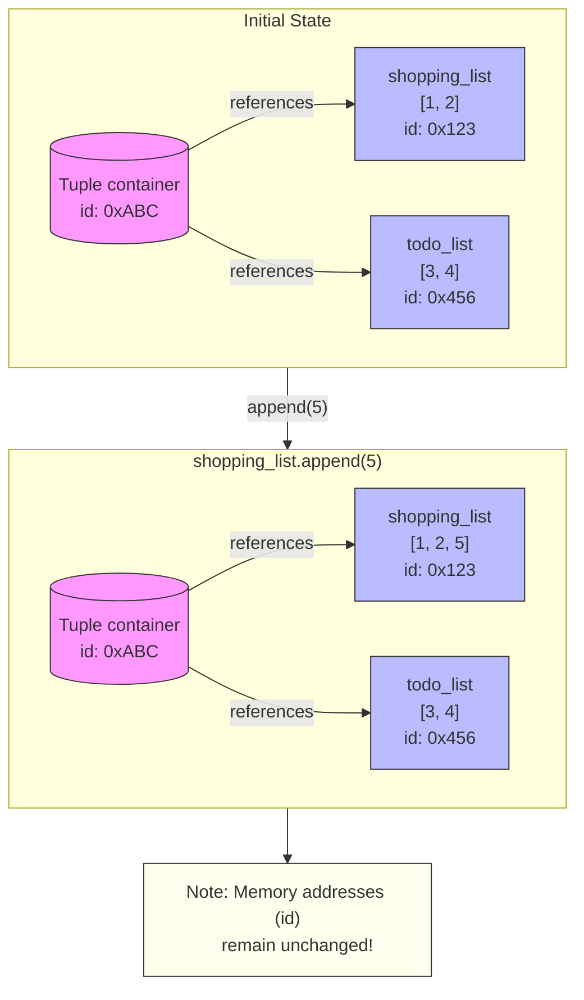
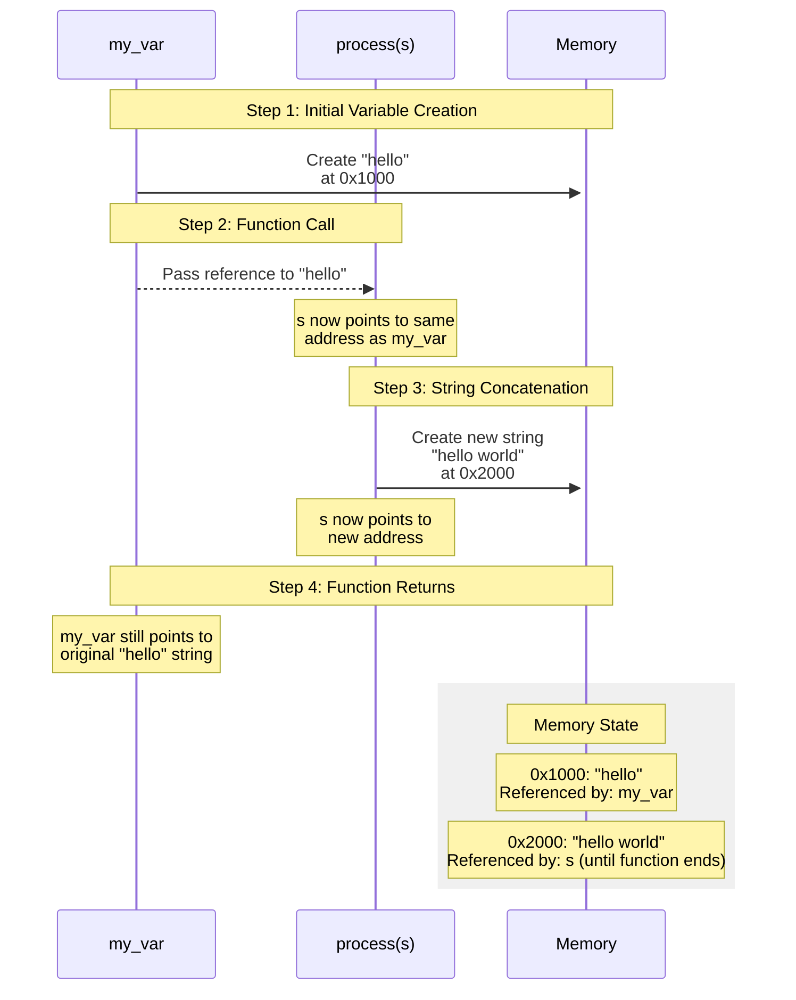
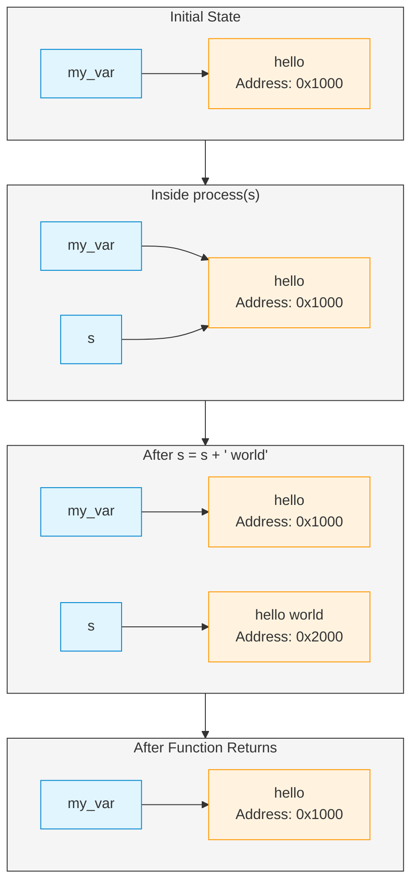
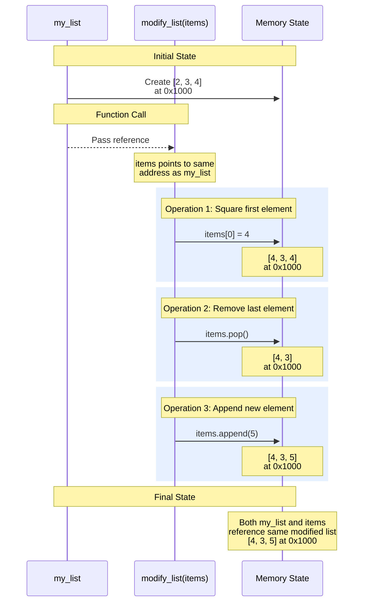
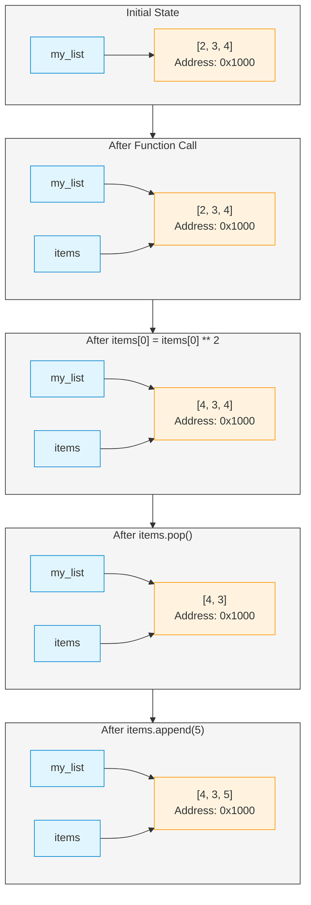
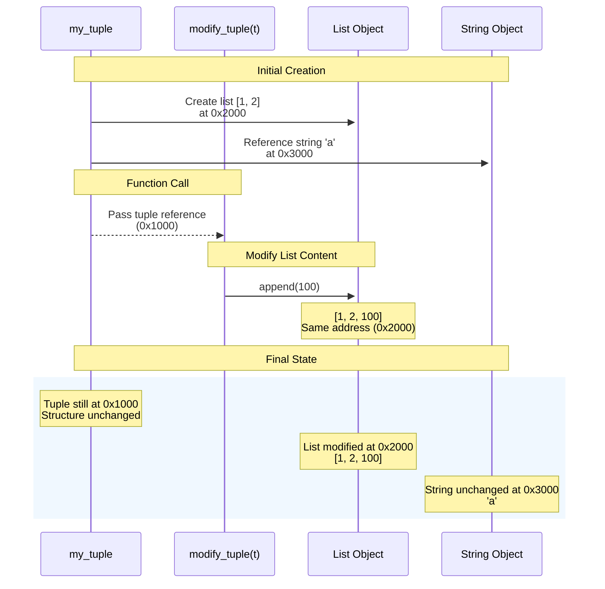
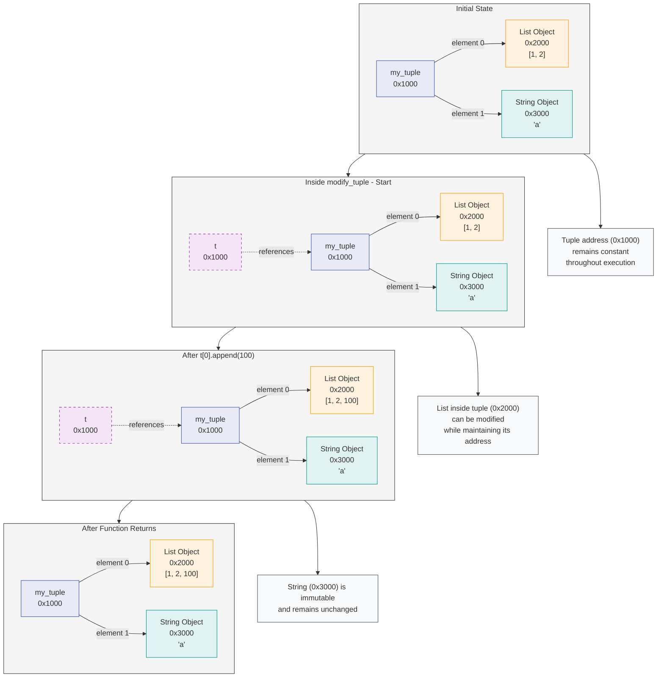

# Python variables and memory references

Think of computer memory like a giant apartment building, where each apartment (memory slot) has a unique address. When we create variables in Python, we're not actually storing the values directly in the variables. Instead, we're storing the "address" where that value lives in memory.

Here's how it works step by step:



When we write code like `my_var = 10`, Python does two key things:

1. First, it finds an available spot in memory (let's say apartment 1000) and stores the value 10 there
2. Then, it makes `my_var` a reference (think of it like a label or pointer) to that memory address

So `my_var` isn't actually equal to 10 - it's more like a note saying "the value you want is stored at address 1000." When we later use `my_var` in our code, Python automatically follows this reference to get the actual value.

To see this in action, Python gives us two helpful functions:

```python
my_var = 10
# id() shows us the memory address as a decimal number
print(id(my_var))  # Might show something like 140712834927872

# hex() can convert this to a more readable hexadecimal number
print(hex(id(my_var)))  # Might show something like '0x7ffff83c1210'
```

This is why when we create different variables, they have different memory addresses:

```python
x = 10
y = "Hello"

# These will show different addresses since they store different values
print(hex(id(x)))
print(hex(id(y)))
```

Understanding this concept becomes particularly important when we start working with mutable objects (like lists) or when we pass variables to functions. The variable itself is just a reference - a signpost pointing to where the actual data lives in memory.

This memory reference system is part of what makes Python's memory management so efficient. Instead of copying values around, Python can just pass around these references, which is much faster and uses less memory.

# Reference counting system

Let me explain Python's reference counting system and how it helps manage memory, building on our earlier discussion about memory references.

Think of reference counting like keeping track of how many people have the key to an apartment. Python needs to know when it's safe to "clear out" the apartment (free up the memory) - which it can only do when no one has a key anymore.

Let's break this down with a practical example:

```python
import ctypes

# Helper function to peek at the reference count
def ref_count(address):
    # Access the memory at 'address' and get its reference count
    return ctypes.c_long.from_address(address).value

# Create our first variable - it's like giving out the first key
my_var = [1, 2, 3, 4]
print(ref_count(id(my_var)))  # Shows 1 reference
```

When we create `my_var`, Python:
1. Creates a list object in memory
2. Starts tracking how many references point to it (initially 1)
3. Makes `my_var` reference that memory location

Now, what happens when we create another reference to the same object?

```python
# Give out another key to the same apartment
other_var = my_var
print(ref_count(id(my_var)))  # Shows 2 references now
```

Both `my_var` and `other_var` are now pointing to the exact same memory location. We can verify this:

```python
print(hex(id(my_var)), hex(id(other_var)))  # They show the same address
```

When we don't need one of these references anymore, Python adjusts the count:

```python
# Take away one of the keys
other_var = None
print(ref_count(id(my_var)))  # Back to 1 reference
```

Setting `other_var` to None is like returning the key - Python sees one fewer reference to that memory location.

You might wonder why we don't use Python's built-in `sys.getrefcount()`. Here's why:

```python
import sys
my_var = [1, 2, 3, 4]
print(sys.getrefcount(my_var))  # Shows 2 instead of 1
```

The count is off by one because `getrefcount()` itself needs to create a temporary reference to the object to count its references! It's like asking someone to count how many people are holding keys, but they need to hold a key themselves to do the counting.

This reference counting system is part of Python's garbage collection - when the reference count drops to zero, Python knows it's safe to reclaim that memory. While you rarely need to work directly with reference counts in everyday Python programming, understanding this mechanism helps explain Python's memory management and becomes particularly important when dealing with circular references or memory-intensive applications.


# Garbage collection


First, let's understand our helper functions:

```python
import ctypes
import gc  # Python's garbage collector module

# This function lets us peek at how many references point to an object
def ref_count(address):
    return ctypes.c_long.from_address(address).value

# This function checks if an object with a specific ID still exists in memory
def object_by_id(object_id):
    for obj in gc.get_objects():  # Look through all objects Python knows about
        if id(obj) == object_id:
            return "Object exists"
    return "Not found"
```

Think of `ref_count` like a special pair of glasses that lets us see how many variables are pointing to a specific spot in memory. We need to use `ctypes` (a low-level way to interact with memory) because Python doesn't normally let us look at these internal details.

Now, for the circular reference example. Imagine two friends who each keep a photo of the other. Even if nobody else has their photos, they still have each other's photos. This is similar to what happens in our code:

```python
class A:
    def __init__(self):
        # When we create A, it immediately creates a B and keeps a reference to it
        self.b = B(self)
        # Print out where this A and its B are stored in memory
        print(f'A: self: {hex(id(self))}, b:{hex(id(self.b))}')

class B:
    def __init__(self, a):
        # B stores a reference to the A that created it
        self.a = a
        # Print out where this B and its A are stored in memory
        print(f'B: self: {hex(id(self))}, a: {hex(id(self.a))}')

# Turn off automatic garbage collection so we can see what happens
gc.disable()

# Create an instance of A (which also creates a B)
my_var = A()
```

Let's see what happens step by step:



1. First, we create an A object with `my_var = A()`
2. When A is created, it immediately creates a B object and stores it in `self.b`
3. When B is created, it stores a reference to the A object in `self.a`

At this point, we have:
- `my_var` points to the A object
- A's `b` property points to the B object
- B's `a` property points back to the A object

We can verify this by looking at the memory addresses:

```python
# Store the IDs so we can track these objects
a_id = id(my_var)
b_id = id(my_var.b)

# Check reference counts
print(f'refcount(a) = {ref_count(a_id)}')  # Shows 2 (my_var and B.a)
print(f'refcount(b) = {ref_count(b_id)}')  # Shows 1 (A.b)
```

Now comes the interesting part. What happens when we remove our `my_var` reference?

```python
my_var = None  # Remove our reference to A

# Check references again
print(f'refcount(a) = {ref_count(a_id)}')  # Shows 1 (only B.a remains)
print(f'refcount(b) = {ref_count(b_id)}')  # Shows 1 (only A.b remains)
```

Even though we can't access these objects anymore (we set `my_var` to None), they're still in memory because they're referencing each other! This is where garbage collection becomes important:

```python
# Run garbage collection manually
gc.collect()

# Check if objects still exist
print('a:', object_by_id(a_id))  # "Not found"
print('b:', object_by_id(b_id))  # "Not found"
```

The garbage collector sees that these objects only reference each other and aren't accessible from our code anymore, so it cleans them up.

Think of it like this: If you have two documents that only reference each other but aren't listed in any file system or directory, they're effectively lost and can be cleaned up. That's what Python's garbage collector does - it finds and cleans up these "orphaned" groups of objects that only reference each other.

# Python's dynamic typing

Let me explain Python's dynamic typing system, which is one of its most powerful and flexible features. This concept builds on our earlier understanding of variables as memory references.

Think of variables in Python like sticky notes that you can move from object to object. The sticky note itself (the variable) doesn't have any inherent type - it just points to whatever object you've attached it to at the moment.

Let's explore this with a practical example:

```python
# Start with a string
a = "hello"
print(f"Value of 'a': {a}")
print(f"Type of 'a': {type(a)}")  # Shows: <class 'str'>

# Now use the same variable name for a number
a = 10
print(f"Value of 'a': {a}")
print(f"Type of 'a': {type(a)}")  # Shows: <class 'int'>

# Now use it for a function
a = lambda x: x**2
print(f"Value of 'a' when called with 2: {a(2)}")  # Shows: 4
print(f"Type of 'a': {type(a)}")  # Shows: <class 'function'>
```

What's happening behind the scenes here? Let's break it down:

1. When we write `a = "hello"`:
   - Python creates a string object containing "hello" in memory
   - The name 'a' becomes a reference to this string object's memory location
   - At this point, `type(a)` shows 'str' because it's looking at the type of object 'a' references

2. Then when we write `a = 10`:
   - Python creates an integer object containing 10 in memory
   - The name 'a' is updated to reference this new integer object instead
   - The string "hello" is still in memory (until garbage collection if nothing else references it)
   - Now `type(a)` shows 'int' because 'a' is referencing an integer object

3. Finally, with `a = lambda x: x**2`:
   - Python creates a function object in memory
   - The name 'a' is updated to reference this function object
   - Now `type(a)` shows 'function' because 'a' references a function object

This is different from statically typed languages like Java or C++, where you might write:
```java
// Java (statically typed)
String a = "hello";  // 'a' can only ever hold strings
a = 10;  // This would cause a compilation error!
```

The benefits of Python's dynamic typing include:
1. Flexibility: Variables can be easily reused for different purposes
2. Rapid development: Less time spent declaring and managing types
3. Duck typing: Focus on what objects can do rather than what they are

However, it's important to understand the implications:
- You need to be more careful about keeping track of what your variables reference
- Type errors might not be caught until runtime
- It's good practice to use meaningful variable names that hint at their intended purpose

#### **A detailed example that will help you understand both dynamic typing and garbage collection in Python.**


``` python
import ctypes
import gc

# Helper function to check reference count without adding a reference
def ref_count(address):
    return ctypes.c_long.from_address(address).value

# Helper function to check if an object still exists in memory
def check_object_exists(object_id):
    for obj in gc.get_objects():
        if id(obj) == object_id:
            return "Object exists"
    return "Not found"

# Turn off automatic garbage collection
print("Disabling automatic garbage collection...")
gc.disable()

# Let's create a variable and watch how its memory location changes
print("\n=== First Assignment: String ===")
x = "Hello Python"
str_address = id(x)
print(f"x = {x}")
print(f"Memory address of x: {hex(str_address)}")
print(f"Type of x: {type(x)}")
print(f"Reference count: {ref_count(str_address)}")

# Now change x to reference an integer
print("\n=== Second Assignment: Integer ===")
x = 42
int_address = id(x)
print(f"x = {x}")
print(f"Memory address of x: {hex(int_address)}")
print(f"Type of x: {type(x)}")
print(f"Reference count: {ref_count(int_address)}")

# Let's check if our original string object still exists
print("\n=== Checking Original String Object ===")
print(f"Original string address: {hex(str_address)}")
print(f"String object status: {check_object_exists(str_address)}")
print(f"String reference count: {ref_count(str_address)}")

# Create a list and make multiple references to it
print("\n=== Creating List with Multiple References ===")
x = [1, 2, 3]
list_address = id(x)
print(f"x = {x}")
print(f"Memory address of list: {hex(list_address)}")
print(f"Initial reference count: {ref_count(list_address)}")

# Create another reference to the same list
y = x
print("\nAfter creating second reference 'y':")
print(f"Reference count: {ref_count(list_address)}")

# And another reference
z = y
print("\nAfter creating third reference 'z':")
print(f"Reference count: {ref_count(list_address)}")

# Remove references one by one
print("\n=== Removing References ===")
x = None
print("After x = None:")
print(f"Reference count: {ref_count(list_address)}")

y = None
print("\nAfter y = None:")
print(f"Reference count: {ref_count(list_address)}")

z = None
print("\nAfter z = None:")
print(f"List object status: {check_object_exists(list_address)}")

# Now let's create some circular references
print("\n=== Creating Circular References ===")
class Node:
    def __init__(self, name):
        self.name = name
        self.next = None

# Create a circular linked list
node1 = Node("First")
node2 = Node("Second")
node1.next = node2
node2.next = node1

# Store the memory addresses
node1_address = id(node1)
node2_address = id(node2)

print(f"Node1 address: {hex(node1_address)}")
print(f"Node2 address: {hex(node2_address)}")
print(f"Node1 reference count: {ref_count(node1_address)}")
print(f"Node2 reference count: {ref_count(node2_address)}")

# Remove our references but keep the circular reference
print("\n=== Creating Orphaned Circular Reference ===")
node1 = None
node2 = None

print("After removing direct references:")
print(f"Node1 reference count: {ref_count(node1_address)}")
print(f"Node2 reference count: {ref_count(node2_address)}")
print(f"Node1 status: {check_object_exists(node1_address)}")
print(f"Node2 status: {check_object_exists(node2_address)}")

# Run garbage collection manually
print("\n=== Running Manual Garbage Collection ===")
gc.collect()

print("After garbage collection:")
print(f"Node1 status: {check_object_exists(node1_address)}")
print(f"Node2 status: {check_object_exists(node2_address)}")

# Re-enable garbage collection
print("\n=== Re-enabling Garbage Collection ===")
gc.enable()
```

### Output



Let me walk you through what's happening in this output, explaining each section and the underlying memory management concepts.

First Assignment (String):
```python
x = "Hello Python"
Memory address: 0x1063aee70
Reference count: 2
```
When we create the string, Python allocates memory at address 0x1063aee70. The reference count is 2 (not 1) because Python internally keeps a reference to commonly used strings as well as our variable 'x'. This is part of Python's string interning optimization.

Second Assignment (Integer):
```python
x = 42
Memory address: 0x103c4bb00
Reference count: 1000000049
```
When we assign x to 42, Python points x to a different memory location. The extremely high reference count for 42 (1000000049) is normal - Python pre-creates and caches small integers because they're used so frequently. This is called integer interning.

Checking Original String:
```python
Original string address: 0x1063aee70
String object status: Not found
String reference count: 1
```
Our original string is no longer directly accessible through our code (x now points to 42), but we can still see its memory address. The "Not found" status indicates it's not in active use, though the reference count of 1 suggests Python's internal reference is still maintaining it.

List References:
```python
x = [1, 2, 3]
Memory address: 0x1063b6180
Initial reference count: 1
```
We create a list and see its reference count start at 1 (x points to it). Then:
- Adding y makes it 2
- Adding z makes it 3
- Removing x reduces it to 2
- Removing y reduces it to 1
- Removing z makes the list inaccessible

Circular References:
```python
Node1 address: 0x1063af9d0
Node2 address: 0x1063e6550
```
This is where it gets interesting. We create two Node objects that point to each other:
```python
node1 → node2
 ↑        ↓
 └────────┘
```
Initially, both nodes have a reference count of 2:
- node1: referenced by our variable 'node1' and by node2.next
- node2: referenced by our variable 'node2' and by node1.next

After setting node1 and node2 to None:
```python
Node1 reference count: 1
Node2 reference count: 1
```
Both objects still exist (status: "Object exists") because they reference each other, even though we can't access them from our code anymore. This is a memory leak that reference counting alone can't solve.

Finally, Manual Garbage Collection:
```python
After garbage collection:
Node1 status: Not found
Node2 status: Not found
```
When we run gc.collect(), Python's garbage collector sees these orphaned objects that only reference each other and cleans them up, freeing the memory.

This example perfectly illustrates how Python manages memory through:
1. Reference counting: Basic memory management where objects are deleted when nothing references them
2. Garbage collection: A second layer that catches circular references that reference counting misses
3. Dynamic typing: How variables can point to different objects at different memory locations
4. Memory optimizations: Like integer and string interning for commonly used values


# Object Interning

Let me help explain what's happening with Python's variable reassignment and memory management. This explores some fascinating behavior that might seem counterintuitive at first.

Let's start with the first part of your example, where we keep reassigning values to `a`:

```python
a = 10
print(f"First assignment:  {hex(id(a))}")      # Let's say 0x7f81c2504430

a = 15
print(f"Second assignment: {hex(id(a))}")      # Different address!

a = 5
print(f"Third assignment:  {hex(id(a))}")      # Different again!

a = a + 1  # Now a becomes 6
print(f"After addition:    {hex(id(a))}")      # Yet another address!
```

What's happening here? Each time we assign a new value to `a`, Python:
1. Creates a new integer object in memory with the new value
2. Makes the variable `a` point to this new memory location
3. The old value might be cleaned up if nothing else references it

Think of it like leaving sticky notes (variables) on different boxes (memory locations). Each time you move the sticky note, it points to a different box containing a different number.

Now here's where it gets interesting! Let's look at the second part:

```python
a = 10
b = 10
print(f"Address of a: {hex(id(a))}")  # Let's say 0x7f81c2504430
print(f"Address of b: {hex(id(b))}")  # Surprise! Same address!
```

Why do `a` and `b` have the same memory address? This is due to an optimization in Python called "integer interning." For commonly used integers (typically -5 to 256), Python creates these numbers once when it starts up and reuses them throughout your program. It's like Python keeps a special drawer of frequently used numbers ready to go.

We can prove this is happening by trying it with larger numbers:

```python
# Let's try with a bigger number
a = 1000
b = 1000
print(f"Big number a: {hex(id(a))}")  # Different addresses!
print(f"Big number b: {hex(id(b))}")  # Because 1000 isn't interned

# But small numbers share addresses
x = 5
y = 5
print(f"Small number x: {hex(id(x))}")  # Same addresses
print(f"Small number y: {hex(id(y))}")  # Because 5 is interned
```

This interning behavior is an optimization that:
1. Saves memory (we don't need multiple copies of common numbers)
2. Speeds up programs (no need to create new objects for common values)
3. Is safe because integers are immutable (they can't be changed after creation)

Python does similar optimizations with small strings and other immutable objects, which we can demonstrate:

```python
# Short strings are interned
s1 = "hello"
s2 = "hello"
print(f"String 1: {hex(id(s1))}")  # Same address!
print(f"String 2: {hex(id(s2))}")  # Same address!

# But longer or unusual strings might not be
s3 = "hello" * 1000
s4 = "hello" * 1000
print(f"Long string 1: {hex(id(s3))}")  # Different addresses
print(f"Long string 2: {hex(id(s4))}")  # Different addresses
```


# Object Mutability

Let me help you understand Python's object mutability through a concrete analogy and detailed examples. This concept is fundamental to understanding how Python manages data in memory.

Think of Python objects like different types of containers:

1. Mutable objects (like lists and dictionaries) are like whiteboards - you can erase and add content while keeping the same board:

```python
# Let's see this with a list
my_list = [1, 2, 3]
original_address = id(my_list)
print(f"Original list: {my_list}")
print(f"Address: {hex(original_address)}")

# When we append, it's like writing more on the same whiteboard
my_list.append(4)
print(f"\nAfter append: {my_list}")
print(f"Address: {hex(id(my_list))}")  # Same address!

print(f"Did address change? {original_address != id(my_list)}")  # False
```

However, when we create a new list through concatenation, it's like getting a completely new whiteboard:

```python
# List concatenation creates a new list
my_list_1 = [1, 2, 3]
original_address = id(my_list_1)
print(f"Original list: {my_list_1}")
print(f"Original address: {hex(original_address)}")

# This creates a new list object
my_list_1 = my_list_1 + [4]
print(f"\nAfter concatenation: {my_list_1}")
print(f"New address: {hex(id(my_list_1))}")  # Different address!

print(f"Did address change? {original_address != id(my_list_1)}")  # True
```

2. Immutable objects (like tuples) are like sealed containers - once created, their contents can't be modified. However, this gets interesting when the sealed container holds references to mutable objects:

```python
# Let's create a tuple containing mutable lists
shopping_list = [1, 2]
todo_list = [3, 4]
container = (shopping_list, todo_list)

print("Original container:")
print(f"Container contents: {container}")
print(f"Container address: {hex(id(container))}")
print(f"Shopping list address: {hex(id(shopping_list))}")

# Now let's modify one of the lists
shopping_list.append(5)

print("\nAfter modifying shopping list:")
print(f"Container contents: {container}")  # The tuple shows the updated list!
print(f"Container address: {hex(id(container))}")  # Same address
print(f"Shopping list address: {hex(id(shopping_list))}")  # Same address
```



This is like having a sealed box (the tuple) that contains keys (references) to other rooms (the lists). You can't add or remove keys from the sealed box, but you can use those keys to change what's in the rooms they point to!

Here's a practical example that brings it all together:

```python
# Let's model a student's grades using both mutable and immutable types
class StudentRecord:
    def __init__(self, name, grades):
        self.name = name                # name is immutable (string)
        self.grades = grades            # grades is mutable (list)
        self.grade_history = (grades,)  # tuple containing the mutable list

    def add_grade(self, grade):
        # This modifies the existing list
        self.grades.append(grade)
        print(f"Grade added: {grade}")
        print(f"Grades list address: {hex(id(self.grades))}")
        print(f"History tuple address: {hex(id(self.grade_history))}")

# Create a student record
student = StudentRecord("Alice", [85, 90, 95])

print("Initial state:")
print(f"Grades: {student.grades}")
print(f"History: {student.grade_history}")

print("\nAdding a new grade:")
student.add_grade(88)
print(f"Updated grades: {student.grades}")
print(f"History (shows change): {student.grade_history}")
```

The key insights here are:
1. Mutable objects can be modified in place, keeping their memory address
2. Operations that create new objects will result in new memory addresses
3. Immutable objects can contain references to mutable objects
4. When a mutable object changes, all references to it see the change

# Function arguments with mutable and immutable objects

Let me help you understand how Python handles function arguments with both mutable and immutable objects. This is a crucial concept that builds on our previous understanding of memory references and object mutability.

## Immutable objects are safe from unintended side-effects
First, let's explore what happens with immutable objects like strings:

```python
def process(s):
    print(f'Initial s address: {hex(id(s))}')
    s = s + ' world'  # Creates a new string object
    print(f'Final s address: {hex(id(s))}')
    
my_var = 'hello'
print(f'my_var address: {hex(id(my_var))}')
process(my_var)
print(f'my_var address after function: {hex(id(my_var))}')
```

When this code runs, something interesting happens. The parameter `s` initially points to the same memory location as `my_var`. But when we try to "modify" the string by concatenating ' world', Python actually creates a new string object and makes `s` point to this new object. This happens because strings are immutable - they cannot be modified in place.



Think of it like having a piece of paper with "hello" written on it. Instead of erasing and writing something new, we have to get a new piece of paper to write "hello world". The original paper (referenced by `my_var`) remains unchanged.



## Mutable objects are not safe from unintended side-effects

Now let's look at mutable objects like lists:

```python
def modify_list(items):
    print(f'Initial items address: {hex(id(items))}')
    if len(items) > 0:
        items[0] = items[0] ** 2  # Modifies the list in place
    items.pop()                   # Removes last element
    items.append(5)               # Adds new element
    print(f'Final items address: {hex(id(items))}')

my_list = [2, 3, 4]
print(f'my_list address: {hex(id(my_list))}')
modify_list(my_list)
print(f'my_list after function: {my_list}')
print(f'my_list address after function: {hex(id(my_list))}')
```

This behaves differently because lists are mutable. When we pass `my_list` to the function, `items` becomes another name pointing to the same list object in memory. Any modifications made through `items` are changing the actual list object, which is why `my_list` sees these changes outside the function.



Think of this like having a whiteboard. Both `my_list` and `items` are looking at the same whiteboard, so when we erase or write new things through `items`, `my_list` sees these changes because it's still looking at that same whiteboard.


## Immutable collection objects that contain mutable objects
The most intriguing case is with immutable containers (like tuples) that contain mutable objects:

```python
def modify_tuple(t):
    print(f'Initial tuple address: {hex(id(t))}')
    t[0].append(100)  # Modifies the list inside the tuple
    print(f'Final tuple address: {hex(id(t))}')

my_tuple = ([1, 2], 'a')  # Tuple containing a list and a string
print(f'Initial tuple content: {my_tuple}')
modify_tuple(my_tuple)
print(f'Final tuple content: {my_tuple}')
```



This is like having a sealed display case (the tuple) that contains a whiteboard (the list). We can't add or remove items from the display case, but we can still write on the whiteboard inside it! The tuple itself hasn't changed - it still contains the same list object and string - but the contents of that list object have been modified.



These behaviors lead to some important programming practices:
1. If you want to prevent modifications to mutable arguments, make a copy before working with them
2. Be especially careful with mutable objects inside immutable containers
3. **Remember that function parameters are just new names for the same objects passed in**

# Shared References 

Let me explain shared references and mutability in Python through a detailed exploration with real-world analogies. This concept is fundamental to understanding how Python manages memory and how variables interact with each other.

Let's start with immutable objects (like strings):

```python
my_var_1 = 'hello'
my_var_2 = my_var_1

print(hex(id(my_var_1)))  # Let's say 0x1000
print(hex(id(my_var_2)))  # Also 0x1000
```

Think of this like having a library book. When `my_var_2 = my_var_1`, it's like both variables are holding identical library cards pointing to the same book. However, because strings are immutable, if we try to "modify" one of them:

```python
my_var_2 = my_var_2 + ' world!'
```

What actually happens is similar to checking out a completely new book. `my_var_2` gets a new library card pointing to a different book, while `my_var_1` keeps pointing to the original. This is safe because the original book (string) never changes.

Now let's look at mutable objects (like lists):

```python
my_list_1 = [1, 2, 3]
my_list_2 = my_list_1

print(hex(id(my_list_1)))  # Let's say 0x2000
print(hex(id(my_list_2)))  # Also 0x2000
```

This is more like having a shared whiteboard. Both variables have keys to the same whiteboard room. When we modify through either variable:

```python
my_list_2.append(4)
print(my_list_1)  # Shows [1, 2, 3, 4]
print(my_list_2)  # Shows [1, 2, 3, 4]
```

Any changes made through one variable are visible through the other because they're looking at the same whiteboard.

Now, here's where Python's memory manager gets clever. Consider this:

```python
a = 10
b = 10
print(hex(id(a)))  # Same address!
print(hex(id(b)))  # Same address!
```

Python's memory manager realizes that since integers are immutable, it's safe to have multiple variables point to the same integer object. It's like having a shelf of pre-printed numbers - when you need a 10, Python just hands you a card pointing to the existing 10 rather than making a new one. This is called "integer interning" and it's an optimization.

However, with mutable objects, Python can't do this optimization:

```python
my_list_1 = [1, 2, 3]
my_list_2 = [1, 2, 3]  # Creates a new list

print(hex(id(my_list_1)))  # Different addresses
print(hex(id(my_list_2)))  # Different addresses
```

Even though these lists contain the same values, Python creates separate objects. It's like giving each variable its own whiteboard with the same initial contents. This is necessary because the lists can be modified independently.

This leads to some important practical implications:
1. When working with mutable objects, be careful about creating shared references unless you specifically want changes to affect all references
2. If you need an independent copy of a mutable object, use methods like `.copy()` or `deepcopy()`
3. Remember that seemingly identical mutable objects are not necessarily the same object in memory

Would you like me to demonstrate any of these concepts further, perhaps with more complex examples involving nested mutable and immutable objects?

